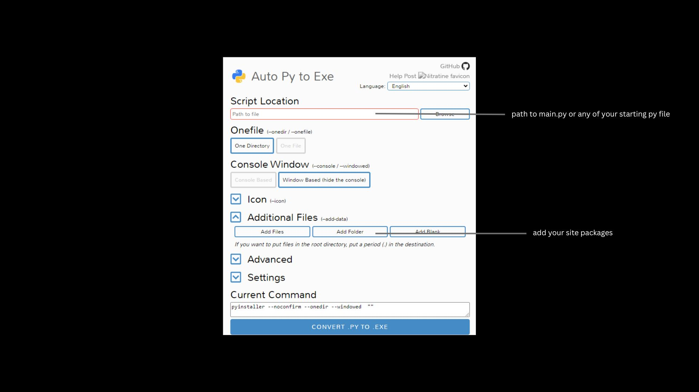

# Custom Automation

Automatizei uma tarefa repetitiva. Certas saídas e códigos são confidenciais e foram intencionalmente ocultados. Utilizei openpyxl e customtkinter para completar este projeto.


<h4>Instale auto_py_to_exe</h4>

```
pip install auto-py-to-exe
```
<h4>Abra o cmd e execute o comando a seguir.</h4>

```
py -m auto_py_to_exe
```



<h4>Os pacotes do site são os módulos incluídos no seu código Python. Para navegar pelos pacotes do site, siga este caminho de arquivo:</h4>
<pre>
C:\Users\username\AppData\Local\Programs\Python\Python311\Lib
</pre>
